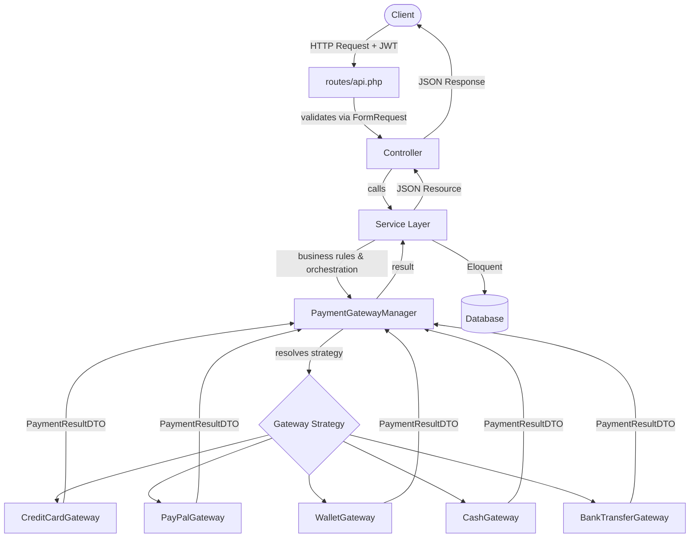
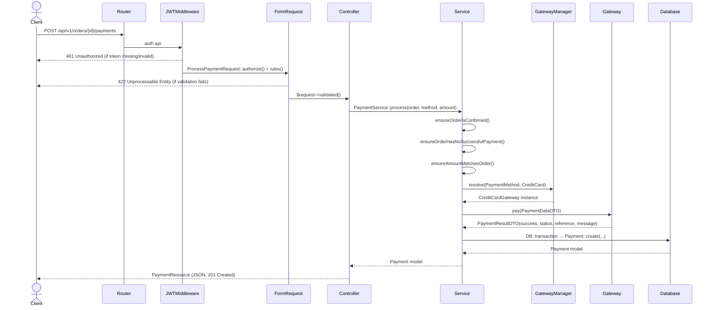
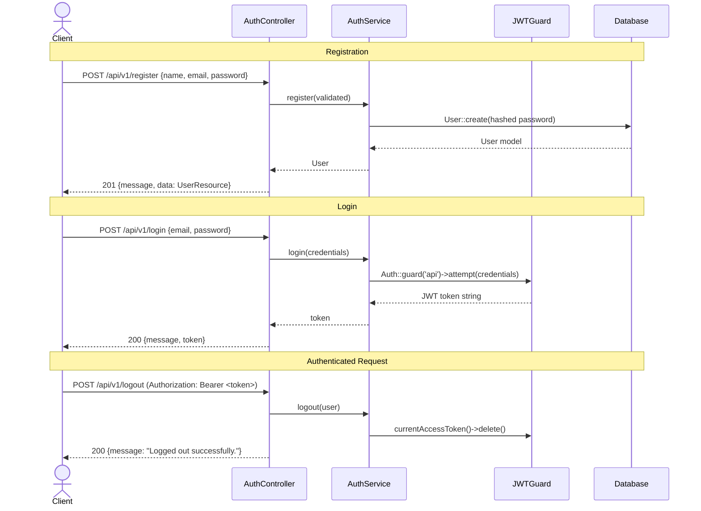
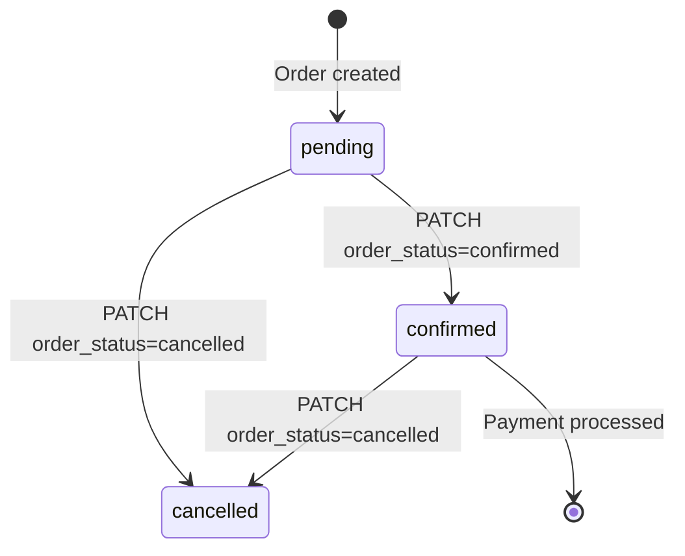
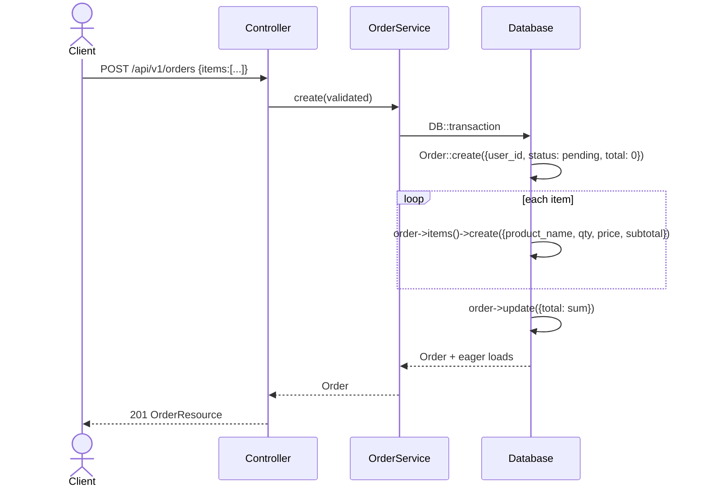
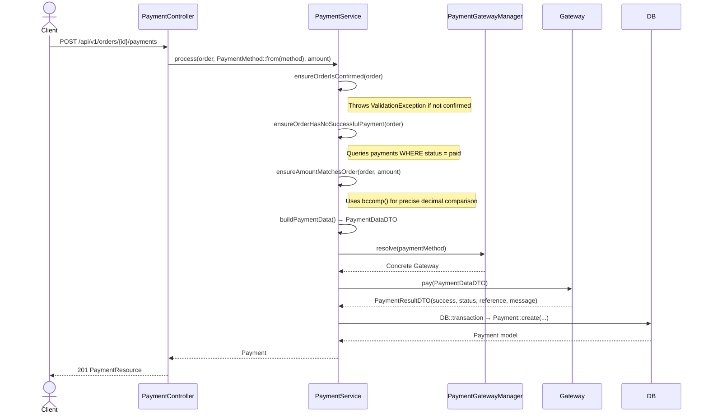
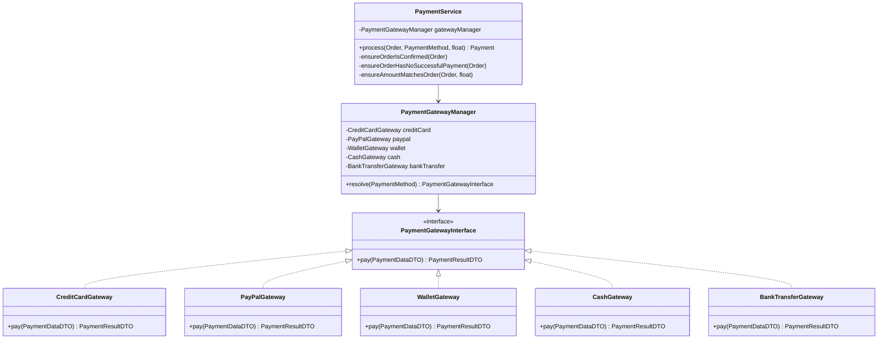
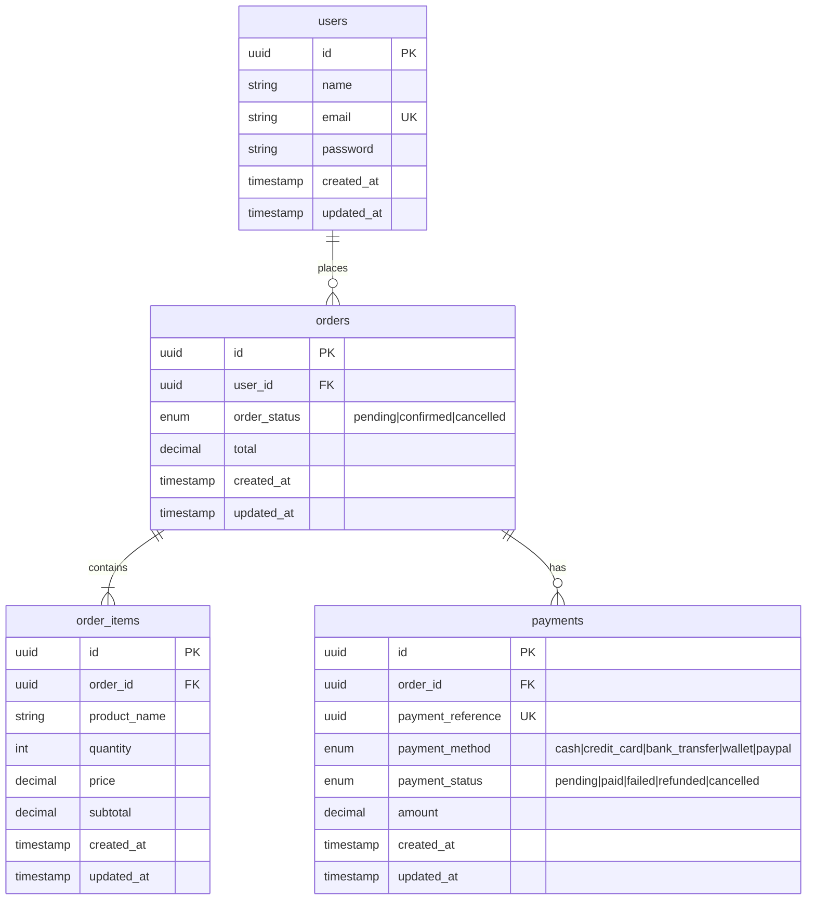
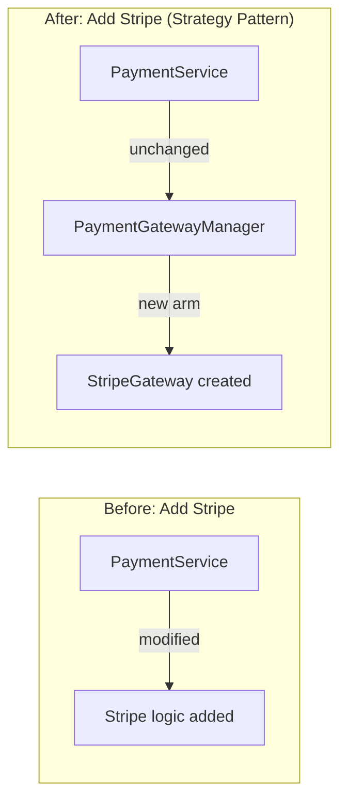

# Extendable Order & Payment API

> A production-grade Laravel 13 REST API implementing clean architecture, the Strategy Pattern for payment gateways, JWT authentication, and comprehensive test coverage via Pest PHP.


---

## Table of Contents

- [Project Overview](#project-overview)
- [Features](#features)
- [Technology Stack](#technology-stack)
- [Project Structure](#project-structure)
- [High-Level Architecture](#high-level-architecture)
- [Request Lifecycle](#request-lifecycle)
- [Authentication Flow](#authentication-flow)
- [Order Module](#order-module)
- [Payment Module](#payment-module)
- [Strategy Pattern](#strategy-pattern)
- [SOLID Principles](#solid-principles)
- [Design Decisions](#design-decisions)
- [API Endpoints](#api-endpoints)
- [Validation Rules](#validation-rules)
- [Error Handling](#error-handling)
- [Database Design](#database-design)
- [Business Rules](#business-rules)
- [Extending the System](#extending-the-system)
- [Configuration](#configuration)
- [Installation](#installation)
- [Running Tests](#running-tests)
- [Postman](#postman)
- [Future Improvements](#future-improvements)
- [Lessons Learned](#lessons-learned)
- [License](#license)

---

## Project Overview

### Business Problem

E-commerce and marketplace systems routinely need to support multiple payment methods — credit cards, PayPal, wallets, bank transfers, cash — each with its own integration logic. Adding or swapping a gateway traditionally required modifying core business logic, introducing regression risk.

### Objective

Build an API that:

- Manages orders (CRUD with status lifecycle) tied to authenticated users
- Processes payments through interchangeable gateways with **zero modification** to existing code when new gateways are introduced
- Enforces strict business rules (confirmed-only payments, duplicate prevention, amount validation)
- Is secured end-to-end with JWT authentication

### Why This Architecture

| Concern                | Decision         | Rationale                                                                                              |
| ---------------------- | ---------------- | ------------------------------------------------------------------------------------------------------ |
| Multiple gateways      | Strategy Pattern | Each gateway is an independent unit; the consumer (`PaymentService`) is decoupled from implementations |
| Business orchestration | Service Layer    | Controllers stay thin; all logic is testable in isolation                                              |
| Type-safe data flow    | DTOs + PHP Enums | Prevents stringly-typed bugs across gateway boundaries                                                 |
| API contracts          | JSON Resources   | Decouples internal model shape from external API shape                                                 |
| Authentication         | JWT (stateless)  | Suitable for REST APIs; no server-side session storage                                                 |

---

## Features

### Authentication

- User registration with validation
- JWT login returning bearer token
- Token-protected logout

### Orders

- Create orders with line items; total calculated automatically
- Update order status (`pending` → `confirmed` → `cancelled`) or replace line items
- Delete orders (enforced: only when no payments exist)
- Paginated order listing with eager-loaded items, payments, and user
- Filter by status

### Payments

- Process a payment against a confirmed order
- Five built-in gateways: `credit_card`, `paypal`, `wallet`, `cash`, `bank_transfer`
- Payment result includes a UUID reference and status
- Duplicate payment prevention (one successful payment per order)
- Payment amount must equal the order total

### Architecture

- Strategy Pattern for gateway selection
- Constructor Dependency Injection throughout
- Service Layer separating business logic from HTTP layer
- DTOs (`readonly` PHP 8.3 classes) for cross-boundary data passing
- PHP 8.1+ Backed Enums for `OrderStatus`, `PaymentMethod`, `PaymentStatus`
- UUID primary keys on all domain models
- JSON API Resources for consistent response shaping

### Testing

- Pest PHP feature tests for Auth, Orders, and Payments
- Unit tests for every individual gateway
- Unit tests for `PaymentGatewayManager` and `PaymentService`
- `RefreshDatabase` for database isolation per test

---

## Technology Stack

| Technology                     | Version | Role                                                      |
| ------------------------------ | ------- | --------------------------------------------------------- |
| PHP                            | ^8.3    | Runtime; enables readonly classes, enums, named arguments |
| Laravel                        | ^13.8   | Framework (routing, Eloquent, validation, DI container)   |
| php-open-source-saver/jwt-auth | ^2.9    | JWT token generation, validation, and guard               |
| SQLite / MySQL                 | —       | Default: SQLite (zero-config dev); configurable for MySQL |
| Pest PHP                       | \*      | Testing framework (wraps PHPUnit with expressive syntax)  |
| Larastan                       | ^3.10   | PHPStan static analysis for Laravel                       |
| Laravel Pint                   | ^1.29   | PSR-12 code style enforcement                             |
| Mockery                        | ^1.6    | Mock objects in unit tests                                |
| Composer                       | 2.x     | Dependency management                                     |
| Postman                        | —       | API documentation and manual testing                      |

---

## Project Structure

```
extendable-order-payment-api/
│
├── app/
│   ├── Contracts/
│   │   └── Payment/
│   │       └── PaymentGatewayInterface.php   # Gateway contract (Strategy interface)
│   │
│   ├── DTOs/
│   │   └── Payment/
│   │       ├── PaymentDataDTO.php            # Input data passed to every gateway
│   │       └── PaymentResultDTO.php          # Normalized result returned by every gateway
│   │
│   ├── Enums/
│   │   ├── OrderStatus.php                  # pending | confirmed | cancelled
│   │   ├── PaymentMethod.php                # cash | credit_card | bank_transfer | wallet | paypal
│   │   └── PaymentStatus.php               # pending | paid | failed | refunded | cancelled
│   │
│   ├── Gateways/
│   │   └── Payment/
│   │       ├── CreditCardGateway.php         # Concrete Strategy: credit card
│   │       ├── PayPalGateway.php             # Concrete Strategy: PayPal
│   │       ├── WalletGateway.php             # Concrete Strategy: digital wallet
│   │       ├── CashGateway.php               # Concrete Strategy: cash
│   │       └── BankTransferGateway.php       # Concrete Strategy: bank transfer
│   │
│   ├── Http/
│   │   ├── Controllers/
│   │   │   ├── Auth/AuthController.php       # register, login, logout
│   │   │   ├── Order/OrderController.php     # CRUD + list (delegates to OrderService)
│   │   │   └── Payment/PaymentController.php # process payment (delegates to PaymentService)
│   │   │
│   │   ├── Requests/
│   │   │   ├── auth/
│   │   │   │   ├── RegisterRequest.php       # name, email, password validation
│   │   │   │   └── LoginRequest.php          # email, password validation
│   │   │   ├── order/
│   │   │   │   ├── StoreOrderRequest.php     # items array validation
│   │   │   │   └── UpdateOrderRequest.php    # optional status + items validation
│   │   │   └── payment/
│   │   │       └── ProcessPaymentRequest.php # order_id, payment_method, amount
│   │   │
│   │   └── Resources/
│   │       ├── Auth/UserResource.php         # id, name, email, created_at
│   │       ├── Order/OrderResource.php       # id, status, total, user, items, payments
│   │       ├── Order/OrderItemResource.php   # product_name, quantity, price, subtotal
│   │       └── Payment/PaymentResource.php   # id, reference, method, status, amount
│   │
│   ├── Models/
│   │   ├── User.php                          # HasUuids, JWT Authenticatable
│   │   ├── Order.php                         # HasUuids, OrderStatus cast, relations
│   │   ├── OrderItem.php                     # HasUuids, belongs to Order
│   │   └── Payment.php                       # HasUuids, PaymentMethod/Status casts
│   │
│   ├── Providers/
│   │   ├── AppServiceProvider.php
│   │   └── PaymentServiceProvider.php        # Reserved for future gateway binding
│   │
│   └── services/
│       ├── Auth/AuthService.php              # register, login (JWT), logout
│       ├── Order/OrderService.php            # paginate, find, create, update, delete
│       └── Payment/
│           ├── PaymentGatewayManager.php     # Resolves PaymentMethod → Gateway instance
│           └── PaymentService.php            # Business rules + gateway orchestration
│
├── database/
│   ├── factories/
│   │   ├── UserFactory.php
│   │   ├── OrderFactory.php                  # Includes confirmed() state
│   │   ├── OrderItemFactory.php
│   │   └── PaymentFactory.php                # Includes paid() state
│   └── migrations/
│       ├── *_create_users_table.php
│       ├── *_create_orders_table.php
│       ├── *_create_order_items_table.php
│       └── *_create_payments_table.php
│
├── routes/
│   └── api.php                               # All routes under /api/v1/
│
└── tests/
    ├── Feature/
    │   ├── Unit/Payment/                     # Unit tests per gateway + manager + service
    │   └── tests/Feature/                    # HTTP feature tests
    ├── TestCase.php
    └── Pest.php                              # Pest configuration and helpers
```

**Folder responsibilities at a glance:**

- `Contracts/` — Interfaces that define what gateways must implement. The only coupling point.
- `DTOs/` — Immutable `readonly` value objects crossing service/gateway boundaries.
- `Enums/` — Type-safe values; eliminate magic strings everywhere in the codebase.
- `Gateways/` — Each file is a self-contained Strategy. Add a file here to add a gateway.
- `Http/Controllers/` — Thin HTTP adapters. Accept request, call service, return resource.
- `Http/Requests/` — All validation isolated here; controllers receive only validated data.
- `Http/Resources/` — API response contracts; internal models never leak to consumers.
- `services/` — All business logic. Framework-agnostic enough to be unit-tested easily.

---

## High-Level Architecture



**Layer responsibilities:**

| Layer       | Class(es)                            | Responsibility                                                                            |
| ----------- | ------------------------------------ | ----------------------------------------------------------------------------------------- |
| Route       | `routes/api.php`                     | Maps URI + method → Controller action, applies `auth:api` middleware                      |
| Validation  | `*Request.php`                       | Rejects invalid input before it reaches any business logic                                |
| Controller  | `*Controller.php`                    | Thin HTTP adapter; transforms validated input into service call; wraps output in Resource |
| Service     | `*Service.php`                       | Owns business rules and orchestrates domain operations                                    |
| Manager     | `PaymentGatewayManager`              | Resolves the correct `PaymentGatewayInterface` from a `PaymentMethod` enum                |
| Gateway     | `*Gateway.php`                       | Encapsulates one payment method's processing logic                                        |
| DTO         | `PaymentDataDTO`, `PaymentResultDTO` | Typed, immutable data carriers between service and gateways                               |
| Model / ORM | `Order`, `Payment`, etc.             | Eloquent models with UUID keys, enum casts, relationships                                 |
| Resource    | `*Resource.php`                      | Shapes model data into the public API response contract                                   |

---

## Request Lifecycle



---

## Authentication Flow

The API uses **JWT (JSON Web Tokens)** via the `php-open-source-saver/jwt-auth` package, configured as the `api` guard. All tokens are stateless.



**Protected routes** are wrapped in `Route::middleware('auth:api')`. Every request to these routes must include:

```
Authorization: Bearer <jwt_token>
```

---

## Order Module

Orders are the primary domain entity. Every order belongs to the authenticated user and contains one or more line items. The total is calculated server-side.

### Status Lifecycle



### Create Order Sequence



### Business Rules

- Orders are always created with `status = pending` and `total = 0`; total is recalculated after all items are inserted inside a `DB::transaction`
- Update can modify `order_status` independently of items, or replace all items (items are deleted and re-created inside a transaction)
- Delete is blocked at the database level when the order has associated payments (`cascadeOnDelete` on `order_items`; soft-blocking via `PaymentService` for payments)

---

## Payment Module



### Payment Statuses by Gateway

| Gateway               | `PaymentStatus` returned | Notes                                  |
| --------------------- | ------------------------ | -------------------------------------- |
| `CreditCardGateway`   | `paid`                   | Simulates instant approval             |
| `PayPalGateway`       | `paid`                   | Simulates instant approval             |
| `WalletGateway`       | `paid`                   | Simulates instant approval             |
| `CashGateway`         | `paid`                   | Simulates instant confirmation         |
| `BankTransferGateway` | `pending`                | Simulates async bank confirmation flow |

---

## Strategy Pattern

### Why Strategy?

The task required adding new payment gateways with **minimal code changes**. The Strategy Pattern allows exactly that: new gateways are added by creating a new class, with no modifications to any existing class.

### Structure



### How It Works

1. `PaymentGatewayInterface` defines the single contract: `pay(PaymentDataDTO): PaymentResultDTO`
2. Each gateway implements this interface independently
3. `PaymentGatewayManager::resolve(PaymentMethod)` maps enum values to gateway instances via PHP `match`
4. `PaymentService` depends only on `PaymentGatewayManager` — never on a concrete gateway

```php
// PaymentGatewayManager — the Strategy context/resolver
public function resolve(PaymentMethod $paymentMethod): PaymentGatewayInterface
{
    return match ($paymentMethod) {
        PaymentMethod::CreditCard  => $this->creditCard,
        PaymentMethod::PayPal      => $this->paypal,
        PaymentMethod::Wallet      => $this->wallet,
        PaymentMethod::Cash        => $this->cash,
        PaymentMethod::BankTransfer => $this->bankTransfer,
    };
}
```

### Benefits

- **Zero modification** to `PaymentService` or `PaymentGatewayManager` when adding a gateway
- Each gateway is independently testable with a mock `PaymentDataDTO`
- `PaymentResultDTO` provides a normalized result regardless of gateway differences
- Laravel's DI container auto-wires gateways into `PaymentGatewayManager`

### Trade-offs

- `PaymentGatewayManager::resolve()` must be updated when a new gateway is registered
- All gateways must be available at boot time (not lazy-loaded); for large numbers of gateways, a registry/factory approach may be more efficient

---

## SOLID Principles

### Single Responsibility Principle

Each class has one reason to change:

- `PaymentService` — business rules for payment processing only
- `PaymentGatewayManager` — gateway resolution only
- `OrderController` — HTTP adaptation for order endpoints only
- `StoreOrderRequest` — validation rules for creating orders only

### Open/Closed Principle

`PaymentService` and `PaymentGatewayManager` are **closed for modification** but **open for extension**. Adding `StripeGateway` requires:

1. Create `app/Gateways/Payment/StripeGateway.php` implementing `PaymentGatewayInterface`
2. Add `stripe` to `PaymentMethod` enum
3. Inject into `PaymentGatewayManager` and add a `match` arm

No line of `PaymentService` changes.

### Liskov Substitution Principle

All five gateways implement `PaymentGatewayInterface`. `PaymentService` receives the result as `PaymentResultDTO` from any gateway without caring which one it called:

```php
$result = $gateway->pay($paymentData); // $gateway is any PaymentGatewayInterface
```

`BankTransferGateway` returns `PaymentStatus::Pending`; `CreditCardGateway` returns `PaymentStatus::Paid` — both are valid `PaymentResultDTO` instances. No substitution breaks the flow.

### Interface Segregation Principle

`PaymentGatewayInterface` exposes exactly one method: `pay()`. Gateways are not forced to implement methods they don't need (e.g., refunds, webhooks). These would be added via separate, focused interfaces.

### Dependency Inversion Principle

High-level modules depend on abstractions:

```php
// PaymentService depends on the manager, not on any concrete gateway
public function __construct(
    private readonly PaymentGatewayManager $gatewayManager,
) {}

// PaymentGatewayManager depends on PaymentGatewayInterface, not concrete classes
public function resolve(PaymentMethod $method): PaymentGatewayInterface { ... }
```

Laravel's DI container injects all dependencies automatically.

---

## Design Decisions

**Why a Service Layer?**
Controllers are HTTP adapters. Placing business logic in services makes it testable without HTTP, reusable across CLI commands or queue jobs, and independently readable.

**Why thin Controllers?**
`OrderController::store()` is four lines: receive request, call service, return resource. No conditionals. No database calls. This makes HTTP behaviour trivially auditable.

**Why FormRequests?**
Validation logic is isolated from the controller entirely. The controller receives `$request->validated()` — a clean array with no invalid data. Business logic in services never needs to re-validate input.

**Why DTOs?**
Rather than passing raw arrays through the gateway boundary, `PaymentDataDTO` and `PaymentResultDTO` are PHP 8.3 `readonly` classes — immutable, type-safe, and self-documenting. Each gateway declares exactly what it receives and returns.

**Why PHP Enums?**
`OrderStatus`, `PaymentMethod`, and `PaymentStatus` are backed string enums. They eliminate magic strings, provide IDE autocompletion, enable exhaustive `match` statements, and are cast automatically by Eloquent models.

**Why UUID primary keys?**
UUID keys (`HasUuids` trait) on `Order`, `OrderItem`, and `Payment` prevent ID enumeration attacks, are safe for distributed systems, and are exposed in the public API without leaking database record counts.

**Why Dependency Injection everywhere?**
Laravel's container wires all services and gateways automatically. Switching an implementation (e.g., in tests) requires registering a different binding — no call site changes.

---

## API Endpoints

All routes are prefixed with `/api/v1/`. Protected routes require `Authorization: Bearer <token>`.

### Authentication

| Method | URI                | Auth      | Description                  |
| ------ | ------------------ | --------- | ---------------------------- |
| `POST` | `/api/v1/register` | —         | Register a new user          |
| `POST` | `/api/v1/login`    | —         | Obtain a JWT token           |
| `POST` | `/api/v1/logout`   | ✅ Bearer | Invalidate the current token |

**Register** `POST /api/v1/register`

```json
// Request
{
  "name": "John Doe",
  "email": "john@example.com",
  "password": "secret123",
  "password_confirmation": "secret123"
}

// Response 201
{
  "message": "User registered successfully.",
  "data": {
    "id": "uuid",
    "name": "John Doe",
    "email": "john@example.com",
    "created_at": "2026-06-26T10:00:00.000000Z"
  }
}
```

**Login** `POST /api/v1/login`

```json
// Request
{
  "email": "john@example.com",
  "password": "secret123"
}

// Response 200
{
  "message": "Login successful.",
  "token": "eyJ0eXAiOiJKV1QiLCJhbGciOiJIUzI1NiJ9..."
}
```

**Logout** `POST /api/v1/logout`

```json
// Response 200
{
    "message": "Logged out successfully."
}
```

---

### Orders

| Method   | URI                   | Auth | Description                          |
| -------- | --------------------- | ---- | ------------------------------------ |
| `GET`    | `/api/v1/orders`      | ✅   | List all orders (paginated, 15/page) |
| `POST`   | `/api/v1/orders`      | ✅   | Create an order                      |
| `GET`    | `/api/v1/orders/{id}` | ✅   | Get a single order                   |
| `PUT`    | `/api/v1/orders/{id}` | ✅   | Update status or replace items       |
| `DELETE` | `/api/v1/orders/{id}` | ✅   | Delete order (no payments)           |

**Create Order** `POST /api/v1/orders`

```json
// Request
{
  "items": [
    { "product_name": "Laptop", "quantity": 2, "price": 500.00 },
    { "product_name": "Mouse",  "quantity": 1, "price": 25.00  }
  ]
}

// Response 201
{
  "data": {
    "id": "018f1a2b-3c4d-7e8f-9a0b-c1d2e3f4a5b6",
    "status": "pending",
    "total": 1025.00,
    "user": { "id": "...", "name": "John Doe", "email": "john@example.com" },
    "items": [
      { "product_name": "Laptop", "quantity": 2, "price": 500.00, "subtotal": 1000.00 },
      { "product_name": "Mouse",  "quantity": 1, "price": 25.00,  "subtotal": 25.00   }
    ],
    "payments": [],
    "created_at": "2026-06-26T10:05:00.000000Z",
    "updated_at": "2026-06-26T10:05:00.000000Z"
  }
}
```

**Update Order** `PUT /api/v1/orders/{id}`

```json
// Request — update status only
{ "order_status": "confirmed" }

// Request — replace items (recalculates total)
{
  "items": [
    { "product_name": "Tablet", "quantity": 1, "price": 300.00 }
  ]
}
```

---

### Payments

| Method | URI                               | Auth | Description                    |
| ------ | --------------------------------- | ---- | ------------------------------ |
| `POST` | `/api/v1/orders/{order}/payments` | ✅   | Process a payment for an order |

**Process Payment** `POST /api/v1/orders/{order}/payments`

```json
// Request
{
  "order_id": "018f1a2b-3c4d-7e8f-9a0b-c1d2e3f4a5b6",
  "payment_method": "credit_card",
  "amount": 1025.00
}

// Response 200
{
  "data": {
    "id": "019a2b3c-4d5e-6f7a-8b9c-0d1e2f3a4b5c",
    "payment_reference": "f47ac10b-58cc-4372-a567-0e02b2c3d479",
    "method": "credit_card",
    "status": "paid",
    "amount": 1025.00,
    "created_at": "2026-06-26T10:10:00.000000Z"
  }
}
```

### HTTP Status Codes

| Code                        | Meaning                             | When                                                    |
| --------------------------- | ----------------------------------- | ------------------------------------------------------- |
| `200 OK`                    | Success                             | GET, PUT, DELETE (when returning data)                  |
| `201 Created`               | Resource created                    | POST /register, POST /orders                            |
| `204 No Content`            | Success, no body                    | DELETE /orders/{id}                                     |
| `401 Unauthorized`          | Missing/invalid JWT                 | Any protected route                                     |
| `404 Not Found`             | Resource not found                  | Order or payment not found                              |
| `422 Unprocessable Entity`  | Validation or business rule failure | Invalid input, pending order payment, duplicate payment |
| `500 Internal Server Error` | Unexpected server error             | Unhandled exceptions                                    |

---

## Validation Rules

### Register

| Field      | Rules                                  |
| ---------- | -------------------------------------- |
| `name`     | required, string, max:255              |
| `email`    | required, email, max:255, unique:users |
| `password` | required, string, min:8, confirmed     |

### Login

| Field      | Rules           |
| ---------- | --------------- |
| `email`    | required, email |
| `password` | required        |

### Create Order

| Field                  | Rules                       |
| ---------------------- | --------------------------- |
| `items`                | required, array, min:1      |
| `items.*.product_name` | required, string, max:255   |
| `items.*.quantity`     | required, integer, min:1    |
| `items.*.price`        | required, numeric, min:0.01 |

### Update Order

| Field                  | Rules                                     |
| ---------------------- | ----------------------------------------- |
| `order_status`         | sometimes, in:pending,confirmed,cancelled |
| `items`                | sometimes, array, min:1                   |
| `items.*.product_name` | required_with:items, string, max:255      |
| `items.*.quantity`     | required_with:items, integer, min:1       |
| `items.*.price`        | required_with:items, numeric, min:0.01    |

### Process Payment

| Field            | Rules                                                     |
| ---------------- | --------------------------------------------------------- |
| `order_id`       | required, uuid, exists:orders,id                          |
| `payment_method` | required, in:cash,credit_card,bank_transfer,wallet,paypal |
| `amount`         | required, numeric, min:0.01                               |

---

## Error Handling

### Validation Error (422)

```json
{
    "message": "The items field is required.",
    "errors": {
        "items": ["At least one order item is required."]
    }
}
```

### Authentication Error (401)

```json
{
    "message": "Unauthenticated."
}
```

### Business Rule Error (422)

```json
// Payment on non-confirmed order
{
  "message": "Only confirmed orders can be paid.",
  "errors": {
    "order": ["Only confirmed orders can be paid."]
  }
}

// Duplicate payment
{
  "message": "This order has already been paid.",
  "errors": {
    "order": ["This order has already been paid."]
  }
}

// Amount mismatch
{
  "message": "Payment amount must equal the order total.",
  "errors": {
    "amount": ["Payment amount must equal the order total."]
  }
}
```

### Invalid Credentials (422)

```json
{
    "message": "Invalid credentials.",
    "errors": {
        "email": ["Invalid credentials."]
    }
}
```

---

## Database Design



**Foreign key behaviour:**

- `orders.user_id` → `users.id` (cascade delete)
- `order_items.order_id` → `orders.id` (cascade delete — items removed when order deleted)
- `payments.order_id` → `orders.id` (cascade delete — note: business logic prevents deletion when payments exist)

All primary keys are UUIDs generated by the database layer via Laravel's `HasUuids` trait.

---

## Business Rules

| Rule                                   | Enforcement                                                                                             | Location                 |
| -------------------------------------- | ------------------------------------------------------------------------------------------------------- | ------------------------ |
| Payments only for **confirmed** orders | `ensureOrderIsConfirmed()` throws `ValidationException` if `order_status !== confirmed`                 | `PaymentService`         |
| **No duplicate successful payments**   | `ensureOrderHasNoSuccessfulPayment()` queries `payments WHERE status = paid`                            | `PaymentService`         |
| **Amount must equal order total**      | `ensureAmountMatchesOrder()` uses `bccomp()` for precise decimal comparison                             | `PaymentService`         |
| **Cannot delete order with payments**  | Prevented by `cascadeOnDelete` on `payments.order_id` at DB level; service-level enforcement via checks | DB + `OrderService`      |
| **Total calculated server-side**       | `OrderService::create()` sums `qty × price` for all items; client cannot send a total                   | `OrderService`           |
| **Orders created as pending**          | Hardcoded in `OrderService::create()`; the status field is not accepted at creation                     | `OrderService`           |
| **Idempotent item replacement**        | `UPDATE` deletes all existing items, then re-creates from payload — no partial updates                  | `OrderService::update()` |

---

## Extending the System

### Adding a New Payment Gateway

The Strategy Pattern makes this a four-step process. **No existing files are modified except `PaymentGatewayManager` and `PaymentMethod`.**

#### Step 1 — Add the Enum Value

```php
// app/Enums/PaymentMethod.php
enum PaymentMethod: string
{
    case Cash         = 'cash';
    case CreditCard   = 'credit_card';
    case BankTransfer = 'bank_transfer';
    case Wallet       = 'wallet';
    case PayPal       = 'paypal';
    case Crypto       = 'crypto';   // ← ADD THIS
}
```

#### Step 2 — Create the Gateway Class

```php
// app/Gateways/Payment/CryptoGateway.php

namespace App\Gateways\Payment;

use App\Contracts\Payment\PaymentGatewayInterface;
use App\DTOs\Payment\PaymentDataDTO;
use App\DTOs\Payment\PaymentResultDTO;
use App\Enums\PaymentStatus;
use Illuminate\Support\Str;

class CryptoGateway implements PaymentGatewayInterface
{
    public function __construct(
        private readonly string $apiKey,
    ) {}

    public function pay(PaymentDataDTO $payment): PaymentResultDTO
    {
        // Call your crypto payment provider SDK here.
        // $payment->amount, $payment->order->id are available.

        return new PaymentResultDTO(
            success: true,
            status: PaymentStatus::Pending,   // async confirmation
            reference: (string) Str::uuid(),
            message: 'Crypto payment initiated. Awaiting blockchain confirmation.',
        );
    }
}
```

#### Step 3 — Register in the Gateway Manager

```php
// app/services/Payment/PaymentGatewayManager.php

use App\Gateways\Payment\CryptoGateway;   // ← ADD IMPORT

class PaymentGatewayManager
{
    public function __construct(
        private CreditCardGateway $creditCard,
        private PayPalGateway $paypal,
        private WalletGateway $wallet,
        private CashGateway $cash,
        private BankTransferGateway $bankTransfer,
        private CryptoGateway $crypto,   // ← ADD INJECTION
    ) {}

    public function resolve(PaymentMethod $paymentMethod): PaymentGatewayInterface
    {
        return match ($paymentMethod) {
            PaymentMethod::CreditCard   => $this->creditCard,
            PaymentMethod::PayPal       => $this->paypal,
            PaymentMethod::Wallet       => $this->wallet,
            PaymentMethod::Cash         => $this->cash,
            PaymentMethod::BankTransfer => $this->bankTransfer,
            PaymentMethod::Crypto       => $this->crypto,   // ← ADD ARM
        };
    }
}
```

#### Step 4 — Add Environment Config (optional)

```env
# .env
CRYPTO_API_KEY=your_key_here
CRYPTO_WEBHOOK_SECRET=your_secret
```

```php
// Bind with config in AppServiceProvider or PaymentServiceProvider
$this->app->when(CryptoGateway::class)
    ->needs('$apiKey')
    ->give(fn() => config('services.crypto.api_key'));
```

**That's it.** `PaymentService` requires zero changes. The Open/Closed Principle is fully satisfied.

#### Compliance with Open/Closed Principle



---

## Configuration

### Environment Variables

```env
# Application
APP_NAME=Laravel
APP_ENV=local
APP_KEY=                        # Generated by: php artisan key:generate
APP_DEBUG=true
APP_URL=http://localhost

# Database (SQLite default — zero-config for development)
DB_CONNECTION=sqlite
# For MySQL, uncomment and fill:
# DB_CONNECTION=mysql
# DB_HOST=127.0.0.1
# DB_PORT=3306
# DB_DATABASE=order_payment_api
# DB_USERNAME=root
# DB_PASSWORD=secret

# JWT (add after running: php artisan jwt:secret)
JWT_SECRET=                     # Generated by: php artisan jwt:secret
JWT_TTL=60                      # Token lifetime in minutes
JWT_ALGO=HS256

# Queue (default: database)
QUEUE_CONNECTION=database
```

### JWT Configuration

JWT settings are in `config/jwt.php`. Key options:

| Key                 | Default | Description                          |
| ------------------- | ------- | ------------------------------------ |
| `ttl`               | `60`    | Token lifetime (minutes)             |
| `algo`              | `HS256` | Signing algorithm                    |
| `blacklist_enabled` | `true`  | Enables token blacklisting on logout |

### Auth Guard

```php
// config/auth.php
'guards' => [
    'api' => [
        'driver'   => 'jwt',
        'provider' => 'users',
    ],
],
```

---

## Installation

### Prerequisites

- PHP 8.3+
- Composer 2.x
- SQLite (built into PHP) **or** MySQL 8.x / MariaDB 10.6+

### Setup

```bash
# 1. Clone the repository
git clone https://github.com/mohamedmostafa3730/extendable-order-payment-api.git
cd extendable-order-payment-api

# 2. Install PHP dependencies
composer install

# 3. Copy environment file
cp .env.example .env

# 4. Generate application key
php artisan key:generate

# 5. Generate JWT secret
php artisan jwt:secret

# 6. Create SQLite database file (if using SQLite — the default)
touch database/database.sqlite

# 7. Run database migrations
php artisan migrate

# 8. (Optional) Seed the database
php artisan db:seed

# 9. Start the development server
php artisan serve
```

The API will be available at `http://localhost:8000/api/v1/`.

### Switching to MySQL

```env
DB_CONNECTION=mysql
DB_HOST=127.0.0.1
DB_PORT=3306
DB_DATABASE=order_payment_api
DB_USERNAME=root
DB_PASSWORD=secret
```

Then re-run migrations: `php artisan migrate:fresh`

### One-command Setup (Composer Script)

```bash
composer run setup
```

This runs: `composer install` → copy `.env` → `key:generate` → `migrate` → `npm install` → `npm run build`

---

## Running Tests

The project uses **Pest PHP** with the Laravel plugin. Tests interact with an in-memory SQLite database (`RefreshDatabase` trait).

### Run All Tests

```bash
php artisan test
# or
./vendor/bin/pest
```

### Run by Group

```bash
# Feature tests (HTTP layer)
./vendor/bin/pest tests/Feature/tests/Feature/

# Unit tests (gateway + service logic)
./vendor/bin/pest tests/Feature/Unit/
```

### With Coverage

```bash
./vendor/bin/pest --coverage
```

### Test Suite Overview

| Test File                       | Type    | Coverage                                                                          |
| ------------------------------- | ------- | --------------------------------------------------------------------------------- |
| `AuthControllerTest.php`        | Feature | Register, login, logout flows                                                     |
| `OrderControllerTest.php`       | Feature | CRUD orders via HTTP                                                              |
| `PaymentControllerTest.php`     | Feature | Payment processing, business rule enforcement                                     |
| `CreditCardGatewayTest.php`     | Unit    | CreditCard gateway `pay()` returns correct DTO                                    |
| `PayPalGatewayTest.php`         | Unit    | PayPal gateway returns correct DTO                                                |
| `WalletGatewayTest.php`         | Unit    | Wallet gateway returns correct DTO                                                |
| `CashGatewayTest.php`           | Unit    | Cash gateway returns correct DTO                                                  |
| `BankTransferGatewayTest.php`   | Unit    | BankTransfer returns pending status                                               |
| `PaymentGatewayManagerTest.php` | Unit    | Manager resolves correct gateway per method                                       |
| `PaymentServiceTest.php`        | Unit    | Successful payment, pending order rejection, amount mismatch, duplicate rejection |

### Expected Output

```
   PASS  Tests\Feature\AuthControllerTest
  ✓ user can register
  ✓ user can login
  ✓ user can logout

   PASS  Tests\Feature\OrderControllerTest
  ✓ user can create order
  ✓ user can view orders
  ✓ user can update order
  ✓ user can delete order

   PASS  Tests\Feature\PaymentControllerTest
  ✓ user can process payment
  ✓ payment fails for pending order
  ✓ payment amount must match order total

   PASS  Tests\Unit\Payment\PaymentServiceTest
  ✓ successful payment creates payment
  ✓ pending order cannot be paid
  ✓ wrong amount is rejected
  ✓ duplicate payment is rejected

  Tests:  14 passed
  Time:   0.82s
```

---

## Postman

### Import Instructions

1. Open Postman → **Import** → **Link** or **File**
2. Import the collection from the repository (if provided) or create manually using the endpoints above
3. Set up an Environment with:

| Variable   | Value                                   |
| ---------- | --------------------------------------- |
| `base_url` | `http://localhost:8000/api/v1`          |
| `token`    | _(populated automatically after login)_ |
| `order_id` | _(set after creating an order)_         |

### Authentication Setup

In the **Login** request, add a **Test** script to auto-populate the token:

```javascript
const response = pm.response.json();
pm.environment.set("token", response.token);
```

Then use `{{token}}` as the Bearer token in all protected requests.

### Recommended Testing Workflow

```
1. POST /register        → Create a user
2. POST /login           → Obtain JWT token (auto-set {{token}})
3. POST /orders          → Create an order (copy the `id` to {{order_id}})
4. PUT  /orders/{{order_id}}   → Update status to "confirmed"
5. POST /orders/{{order_id}}/payments → Process payment
6. GET  /orders          → List all orders with payment history
7. POST /logout          → Invalidate token
```

---

## Future Improvements

| Enhancement          | Benefit                                                                     |
| -------------------- | --------------------------------------------------------------------------- |
| Payment webhooks     | Async gateway confirmation (especially for `bank_transfer`)                 |
| Refund support       | New `RefundGatewayInterface` following the same Strategy pattern            |
| Queue-based payments | Non-blocking payment processing via `PaymentJob`                            |
| Event broadcasting   | `PaymentProcessed`, `OrderStatusChanged` events for decoupled side-effects  |
| Order filtering      | Query scopes for `status`, `date_range`, `user_id` filters on `GET /orders` |
| Rate limiting        | Throttle payment endpoints to prevent abuse                                 |
| Caching              | Cache order totals and payment status for read-heavy workloads              |
| OpenAPI / Swagger    | Auto-generated API documentation from route definitions                     |
| Docker / Sail        | Zero-config containerized environment                                       |
| CI/CD Pipeline       | GitHub Actions: lint (Pint), analyse (Larastan), test (Pest), deploy        |
| Admin dashboard      | Order management UI for operators                                           |
| Audit logging        | Immutable log of all state transitions                                      |
| Soft deletes         | Archive orders instead of hard-deleting them                                |
| Multi-currency       | ISO 4217 currency support on orders and payments                            |
| Notifications        | Email/SMS on payment success/failure via Laravel Notifications              |

---

## Lessons Learned

**Architecture pays dividends immediately.** Isolating gateways behind `PaymentGatewayInterface` meant every unit test was written once — adding a fifth gateway required writing one test file, not modifying any existing test.

**DTOs prevent invisible bugs.** Passing `PaymentDataDTO` across the service/gateway boundary meant the compiler (Larastan) could verify the entire flow before a single request ran. Magic arrays would have let typos through to runtime.

**PHP 8.3 readonly classes are ideal for value objects.** `PaymentDataDTO` and `PaymentResultDTO` cannot be mutated after construction — exactly what you want for data carriers.

**Pest + Laravel make testing enjoyable.** `RefreshDatabase`, factory states (`->confirmed()`, `->paid()`), and `assertDatabaseHas()` together produced meaningful tests in very few lines.

**Enums replaced a category of bugs entirely.** Before PHP 8.1 enums, `payment_method` values were strings checked via `in_array`. With backed enums and Eloquent casting, invalid values throw a `ValueError` at the PHP level — not a silent data corruption.

**Laravel's DI container is the glue.** `PaymentGatewayManager` receives five concrete gateways through constructor injection. Zero service provider binding was needed because Laravel auto-wires concrete classes. Adding `CryptoGateway` required only a new constructor parameter.

---

## License

This project is open-source software licensed under the **MIT License**.

```
MIT License

Copyright (c) 2026 Mohamed Mostafa

Permission is hereby granted, free of charge, to any person obtaining a copy
of this software and associated documentation files (the "Software"), to deal
in the Software without restriction, including without limitation the rights
to use, copy, modify, merge, publish, distribute, sublicense, and/or sell
copies of the Software, and to permit persons to whom the Software is
furnished to do so, subject to the following conditions:

The above copyright notice and this permission notice shall be included in all
copies or substantial portions of the Software.

THE SOFTWARE IS PROVIDED "AS IS", WITHOUT WARRANTY OF ANY KIND, EXPRESS OR
IMPLIED, INCLUDING BUT NOT LIMITED TO THE WARRANTIES OF MERCHANTABILITY,
FITNESS FOR A PARTICULAR PURPOSE AND NONINFRINGEMENT. IN NO EVENT SHALL THE
AUTHORS OR COPYRIGHT HOLDERS BE LIABLE FOR ANY CLAIM, DAMAGES OR OTHER
LIABILITY, WHETHER IN AN ACTION OF CONTRACT, TORT OR OTHERWISE, ARISING FROM,
OUT OF OR IN CONNECTION WITH THE SOFTWARE OR THE USE OR OTHER DEALINGS IN THE
SOFTWARE.
```

---

<p align="center">
  Built with ❤️ using Laravel 13 · PHP 8.3 · Strategy Pattern · Pest PHP
</p>
